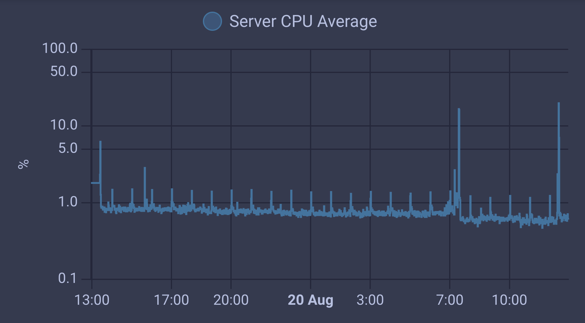

## Introduction

I recently upgraded my home lab with an [Intel 12th gen N100](https://www.intel.com/content/www/us/en/products/sku/231803/intel-processor-n100-6m-cache-up-to-3-40-ghz/specifications.html) and moved my Home Assistant installation from HAOS to a docker compose setup on top of Debian.

I wanted to have in Lovelace UI some CPU indicators and since HA supports [command line sensors](https://www.home-assistant.io/integrations/command_line) I decided to build it myself.

That's what I wanted to achieve :



A simple graph showing CPU utilization over time.

This metric could be retrieved from numerous pieces of software but there were some downside:

- They are often bundled with a **lot** of other features you don't need ( _KISS_[^1] )
- You still need to parse the response of those tools to **fit your needs**

[^1]: Used as a reminder to keep it simple, stupid.

_What if we could do it with 30 lines of Bash?_

## Diving

A standard monitoring agent will read `/proc/stat` and extract the useful values. For example [Node Exporter](https://github.com/prometheus/node_exporter) rely on the [procfs Go lib](https://github.com/prometheus/procfs) that eventually reads `/proc/stat`:

code sample:

```go
func (fs FS) Stat() (Stat, error) {
	fileName := fs.proc.Path("stat")
// ...
	procStat, err := parseStat(bytes.NewReader(data), fileName)
// ...
	return procStat, nil
}
```

And then parse the output:

```go
count, err := fmt.Sscanf(line, "%s %f %f %f %f %f %f %f %f %f %f",
		&cpu,
		&cpuStat.User, &cpuStat.Nice, &cpuStat.System, &cpuStat.Idle,
		&cpuStat.Iowait, &cpuStat.IRQ, &cpuStat.SoftIRQ, &cpuStat.Steal,
		&cpuStat.Guest, &cpuStat.GuestNice)
```

## Analyse

So what is `/proc/stat` exactly ?

According to [kernel.org](https://docs.kernel.org/filesystems/proc.html#miscellaneous-kernel-statistics-in-proc-stat) documentation:

> Various pieces of information about kernel activity are available in the /proc/stat file.

A tipical output of `/proc/stat` will look like this:

```text
cpu  824874 78 739416 174945889 32253 0 5854 0 0 0
cpu0 203622 16 184393 43744091 6437 0 553 0 0 0
cpu1 206511 14 186828 43724029 8547 0 3064 0 0 0
cpu2 ...
...
```

The documentation state

> The very first “cpu” line aggregates the numbers in all of the other “cpuN” lines. These numbers identify the amount of time the CPU has spent performing different kinds of work. Time units are in USER_HZ (typically hundredths of a second).

What those seconds represent?

From left to right:

- **user:** normal processes executed at user-level

- **nice:** niced processes executed at user-level (with a positive nice value)

- **system:** processes executed at kernel-level

- **idle:** doing nothing

- **iowait:** waiting for I/O to complete (disk or network access...). _Note: The documentation state: `iowait is not reliable`_

- **irq:** time spent handling hardware interrupt requests

- **softirq:** time spent handling software interrupt requests

and three others that are only important if you are in a virtualized environment:

- **steal:** involuntary wait

- **guest:** running a normal guest

- **guest_nice:** running a niced guest

## Plan

The metric we are looking for is a [gauge](https://prometheus.io/docs/concepts/metric_types/#gauge), in which each point will records the CPU utilization at the time of measurement.

So first we will distribute the values in two categories:

1. Is the cpu actually working on something _(user, nice, system, irq, softirq, guest, guest_nice)_

2. Is the cpu at rest _(idle, iowait, steal)_ - we usually count iowait as idle because the cpus can be used by other programs while waiting.

Then sum every point of data for each category.

At that point we will get roughly, since system first boot, an amount of seconds where the cpu was busy and an amount of seconds where cpu was doing nothing.

With some simple math, we could determine a percentage of average usage since first boot:

```txt
100*time_doing_something/(time_doing_something+time_doing_nothing)
```

But those values are not the most useful and more details would be welcome... So we can see spikes, drops etc.

The best strategy would be to have the time spent in each category at a given granurality _(for example per minute)_. We will do so by calculating the increases on every time period.

_Our plan is now established, we can start scripting it. Given the low complexity of the task, Bash seems to be the best suited tool_

## Script

```bash
#!/bin/bash

# Function to read idle time and total time
read_cpu_stats () {
    # Read CPU metrics (we don't need details per core for this use case)
    read -ra cpu_stats <<< $(cat /proc/stat | grep '^cpu ')

    # We sum our metrics per category
    # In my homelab, I'm not working in a virtualized environment
    # so I decide to ignore `steal`, `guest` and `guest_nice`
    # ( user + nice + system + irq + softirq )
    non_idle_time=$(( ${cpu_stats[1]} + ${cpu_stats[2]} + ${cpu_stats[3]} + ${cpu_stats[6]} + ${cpu_stats[7]} ))
    # ( idle + iowait )
    idle_time=$(( ${cpu_stats[4]} + ${cpu_stats[5]} ))

    # Compute the total
    total_time=$(( $idle_time + $non_idle_time ))

    # Return idle and total
    echo -n $idle_time $total_time
}

# Get CPU stats initially
read -r idle_time_0 total_time_0 <<< $(read_cpu_stats)

# Get CPU stats 60 seconds later
sleep 60
read -r idle_time_1 total_time_1 <<< $(read_cpu_stats)

# Diff between T+0 and T+60s
diff_idle_time=$(( $idle_time_1 - $idle_time_0 ))
diff_total_time=$(( $total_time_1 - $total_time_0))

# Return the average CPU over the last 60 seconds with a precision of 2
echo -n $(echo "scale=2; 100*($diff_total_time - $diff_idle_time)/$diff_total_time" | bc)
```

Sample output:

```bash
1.28
```

Which indicates the CPU was overall busy 1.28% of the time during the given 60 seconds.

## Conclusion

🎉 Nailed it! Now I only have to call the script every 60 seconds from Home Assistant and make it a sensor. The metric will then end up in my InfluxDB.

Have a nice day! 👋
